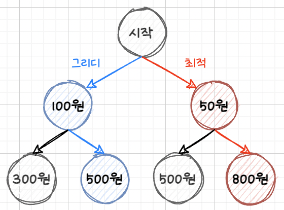

# 03. Greedy Algorithm

그리디 알고리즘은 **현재 상황에서 최적이라고 생각하는 해를 선택하는 방법**입니다.

그러나 앞으로 남은 선택들을 고려하지 않고 현재 상황에서 가장 좋은 결과를 선택하는 것이기에
최종적인 결과 도출에 대한 최적해를 보장해주는 것은 아닙니다.

예를 들어 아래와 같은 트리가 있고, 트리를 지나며 많은 돈을 가져가는 문제가 있다고 가졍해봅시다.

우리는 가장 좋은 결과가 **[시작-50원-800원]** 을 거치는 경로가 많은 돈을 가져갈 수 있다는 것을 알 수 있습니다.
하지만 그리디 알고리즘을 사용한다면 시작 지점에서 더 많은 돈인 **100원**을 선택하게 됩니다.
이렇듯 현재 상황에서 더 많은 돈을 선택하며 결과적으로 **[시작-100원-500원]** 을 거치는 경로를 통해 돈을 가져가게 됩니다.

이 상황을 통해 그리디가 항상 최적해를 보장해주는 것이 아님을 확인할 수 있습니다.

## 그리디 알고리즘 조건
그렇다면 그리디 알고리즘을 통해 최적해를 도출하려면 다음 두 가지 조건을 성립해야 합니다.
### 1. 탐욕적 선택 속성 (greedy choice property)
탐욕적인 선택은 항상 안전하다는 것이 보장되어야 합니다.
여기서 "안전하다"라는 것은 현재 선택이 최종적인 결과의 최적해를 반드시 도출할 수 있어야 한다는 의미입니다.
### 2. 최적 부분 구조 (optimal substructure)
문제에 대한 최종 해결 방법은 부분 문제에 대한 최적 문제 해결 방법으로 구성되어야 합니다.

## 대표적인 그리디 알고리즘 문제
### 거스름돈
K가 자주 방문하는 편의점은 500원, 100원, 50원, 10원이 충분히 있으며, 항상 거스름돈 개수를 최소한으로 줍니다.
K가 구매하려는 물견의 총 금액이 4320원이 나왔을 때, 편의점에서 거슬러주는 돈은 얼마일까요?

1. 거스름돈의 동전 개수를 줄이기 위해 가장 큰 동전부터 선택합니다.
2. 1번 과정을 통해 선택된 동전들의 합이 거슬러 줄 금액을 초과하는지 검사합니다.
   - 초과 시 마지막에 선택한 동전을 제외하고, 1번으로 돌아가 더 작은 동전을 선택합니다.
3. 선택된 동전들의 합이 거슬러줄 금액과 일치하는지 검사합니다.
   - 액수가 부족하면 1번 과정부터 다시 반복합니다.

이 과정을 통해 500원 1개, 100원 1개, 50원 1개, 10원 3개의 순서대로 거슬러줍니다.

### 강의실 선택
한 강의실에서 최대한 많은 여러 개의 수업을 진행하려고 합니다.
아래와 같이 Si는 시작 시간, Fi는 종료 시간, i는 각 수업이라고 할 때, 최대 몇 개의 수업을 할 수 있을까요?

1. 최대한 많은 수업을 위해 남아있는 강의 중 가장 먼저 끝나는 강의를 선택합니다.
   - 만약, 강의가 두 개 이상 존재하면 먼저 시작하는 강의를 선택합니다.
2. 1번 과정을 통해 선택한 수업의 시작 시간이 진행할 수 있는 수업인지 검사합니다.
   - 시작할 수 없는 수업이라면 해당 수업을 제외하고, 1번으로 돌아가 다음으로 먼저 끝나는 강의를 선택합니다.

이 과정을 통해 선택된 수업은 a1, a3, a6, a8로 최대 4개의 수업을 진행할 수 있습니다.

## 🔗 참고
- [Yonggeun Shin - [Algorithm] 탐욕 알고리즘 (Greedy algorithm)](https://yganalyst.github.io/concept/algo_cc_book_1/)
- [contea95.log - 탐욕법(그리디) 알고리즘](https://velog.io/@contea95/%ED%83%90%EC%9A%95%EB%B2%95%EA%B7%B8%EB%A6%AC%EB%94%94-%EC%95%8C%EA%B3%A0%EB%A6%AC%EC%A6%98)
- [HANAMON - [알고리즘] 탐욕 알고리즘 (Greedy Algorithm)](https://hanamon.kr/%EC%95%8C%EA%B3%A0%EB%A6%AC%EC%A6%98-%ED%83%90%EC%9A%95%EC%95%8C%EA%B3%A0%EB%A6%AC%EC%A6%98-greedy-algorithm/)
- [ZeroCho - 탐욕(그리디) 알고리즘(greedy algorithm)](https://www.zerocho.com/category/Algorithm/post/584ba5c9580277001862f188)