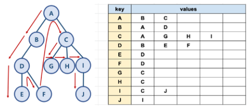

# 04. DFS

# ♦️ 그래프 탐색이란?

> **📌 그래프 탐색** : 하나의 정점으로부터 시작하여 차례대로 모든 정점들을 한 번씩 방문하는 방법을 말한다.

<br>

## ♦️ 깊이 우선 탐색 (DFS:Depth-First Search)

> **📌 깊이 우선 탐색** : 루트 노드(혹은 다른 임의의 노드)에서 시작하여 다음 분기(branch)로 넘어가기 전에 해당 분기를 완벽하게 탐색하는 방법. 즉, 자식들을 우선적으로 탐색하는 방식으로 **Stack** 또는 **재귀 함수**를 사용해서 구현한다.

- 또한, DFS는 주로 **순환이 존재하는지 확인하는 경우 많이 사용**한다.

<br>

### ✔️ <b>장점</b>

- 현 경로상의 노드들만 기억하면 되기 때문에 저장공간의 수요가 비교적 적다.
- 최선의 경우, 가장 빠른 알고리즘이다. 즉, 찾으려는 노드가 깊은 depth에 존재한다면 BFS보다 빠르게 찾을 수 있다.

### ✔️ <b>단점</b>

- 최선의 해가 최단 경로가 된다는 보장이 없다.
    - 목표에 이르는 경로(답)이 다수인 문제에서 DFS는 해에 다다르면 탐색을 종료하기 때문에 얻어진 해가 최적의 해가 아닐 수 있다.
    - **최단 경로를 찾을 때에는 BFS 알고리즘을 사용하는것이 효율적**이다. BFS는 최단 경로를 즉각적을 보장해주시면서 탐색이 가능하다. 하지만 DFS는 그렇지 못한 경우가 존재한다.
- 최악의 경우 가능한 모든 경로를 탐색해야만 해를 찾을 수 있기 때문에 엄청난 시간이 걸린다.
    - (EX) Depth가 무한할 경우, 해를 찾을 수 없을 가능성이 높다.
    - 이럴때를 대비해서, <b>깊이제한(Depth bound)</b>를 사용한다.


### ✔️ <b>DFS</b> : 그림으로 이해하기



* 방문순서 : A - B - D - E - F - C - G - H - I - J
* 한 노드의 자식을 타고 끝까지 순회한 후, 다시 돌아와서 다른 형제들의 자식을 타고 내려가며 순회함
<br>

## 코드로 DFS 구현하기

### 👉🏻 <b>Stack(Deque)</b> 이용

```python
def dfs2(graph, start_node):
    ## deque 패키지 불러오기
    from collections import deque
    visited = []
    stack = deque()
    
    ##시작 노드 설정해주기
    stack.append(start_node)
    
    ## 방문이 필요한 리스트가 아직 존재한다면
    while stack:
        ## 시작 노드를 지정하고
        node = stack.pop()
 
        ##만약 방문한 리스트에 없다면
        if node not in visited:
 
            ## 방문 리스트에 노드를 추가
            visited.append(node)
            ## 인접 노드들을 방문 예정 리스트에 추가
            stack.extend(graph[node])
                
    return visited
```

### 👉🏻 <b>재귀</b> 이용하기

```python
def dfs_recursive(graph, start, visited = []):
## 데이터를 추가하는 명령어 / 재귀가 이루어짐 
    visited.append(start)
 
    for node in graph[start]:
        if node not in visited:
            dfs_recursive(graph, node, visited)
    return visited
```

<br>

### [참고]

[https://makemethink.tistory.com/148](https://makemethink.tistory.com/148)

[https://www.fun-coding.org/Chapter18-dfs-live.html](https://www.fun-coding.org/Chapter18-dfs-live.html)

[https://www.fun-coding.org/Chapter18-dfs-live.html](https://www.fun-coding.org/Chapter18-dfs-live.html)