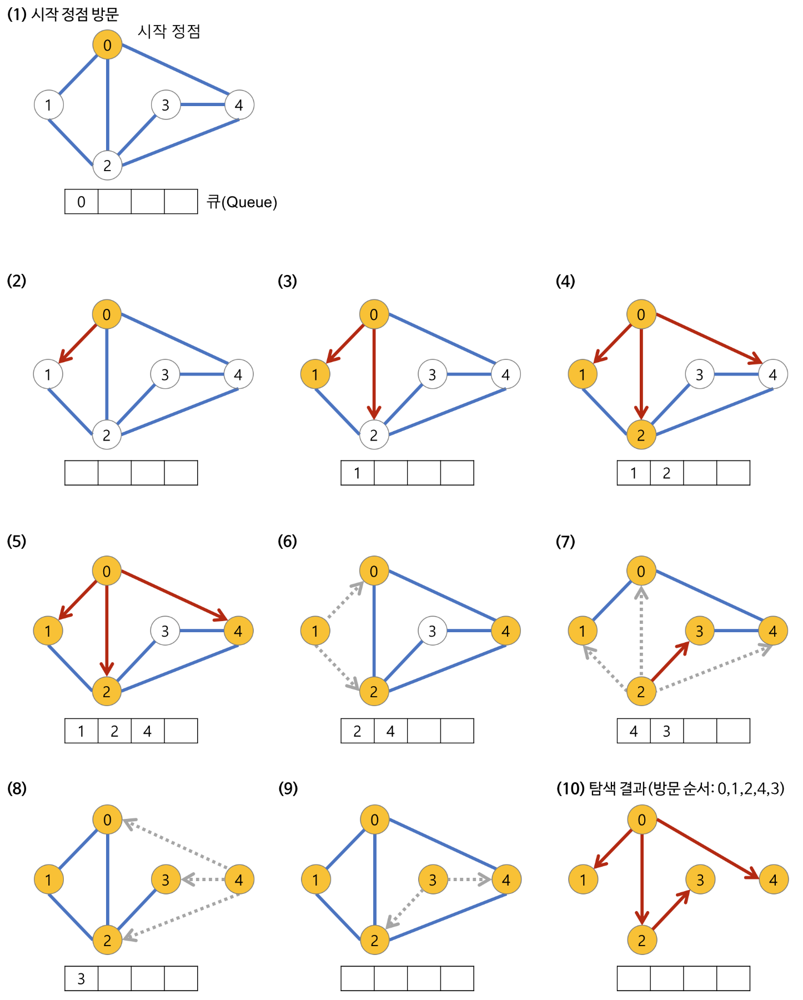
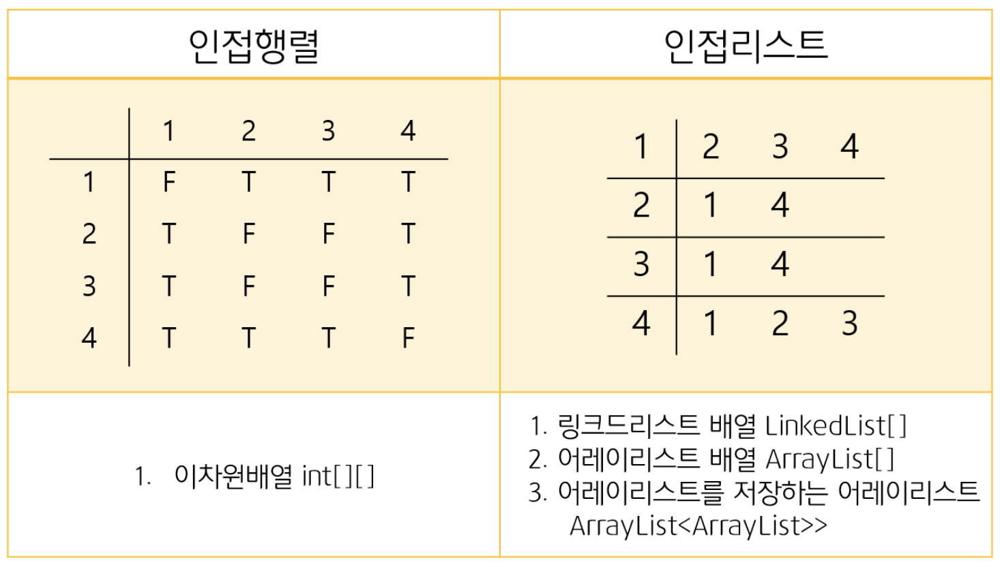

# BFS (너비 우선 탐색, Breadth-First Search)

> 루트 노드에서 시작해서 인접한 노드를 먼저 탐색하는 방법

## 특징

### 장점

- 노드 수가 적고 깊이가 얕은 경우 빠르게 동작 가능
- 단순 검색 속도가 깊이 우선 탐색 (DFS) 보다 빠름
- 너비를 우선 탐색하기에 답이 되는 경로가 여러 개인 경우 최단 경로임을 보장
- 최단 경로가 존재한다면 어느 한 경로가 무한히 깊어진다해도 최단 경로를 반드시 찾을 수 있음

### 단점

- 재귀 호출의 DFS 와 달리 큐에 다음으로 탐색할 정점들을 저장해야 하므로 저장 공간이 많이 필요함
- 노드 수가 늘어나면 탐색해야 하는 노두 또한 많아짐

## 노드 탐색 순서

1. 루트 노드에서 시작한다.
2. 루트 노드와 인접하고 방문된 적 없으며, 큐에 저장되지 않은 노드를 큐에 넣는다.
3. 큐에서 노드를 꺼내어 그와 인접한 노드들 중 방문된 적 없으며, 큐에 저장되지 않는 노드를 큐에 넣는다.
4. 큐가 소진될 때까지 3을 반복한다.



## 구현 방식



### 인접 행렬

인접 행렬로 구현 시 필요한 구조

1. 인접 행렬 배열 (int[][] graph)
2. 방문 여부 배열 (boolean[] isVisited)
3. 큐 (Queue queue)
4. 방문한 노드를 순서대로 저장하는 배열 (ArrayList visitArr)

시간 복잡도 : O(N^2)

```java
import java.util.*;

class BFS1 {
    public static void main(String[] args) {
        int nodeNum = 5; // 위 예제에 맞게 nodeNum 5로 설정
        int[][] graph = new int[nodeNum][nodeNum]; // 인접 행렬 배열

        // 인접한 노드 정보 추가
        graph[0][1] = 1;
        graph[0][2] = 1;
        graph[0][4] = 1;
        graph[1][0] = 1;
        graph[1][2] = 1;
        graph[2][0] = 1;
        graph[2][1] = 1;
        graph[2][3] = 1;
        graph[2][4] = 1;
        graph[3][2] = 1;
        graph[3][4] = 1;
        graph[4][0] = 1;
        graph[4][2] = 1;
        graph[4][3] = 1;

        bfs(nodeNum, graph);
    }

    private static void bfs(int nodeNum, int[][] graph) {
        boolean[] isVisited = new boolean[nodeNum];
        ArrayList<Integer> visitArr = new ArrayList<>();
        Queue<Integer> queue = new LinkedList<>();
        queue.add(0); // 시작 위치 추가
        isVisited[0] = true; // 방문 표시

        while (!queue.isEmpty()) {
            int node = queue.poll(); // 현재 방문 노드
            visitArr.add(node);

            for (int i = 0; i < nodeNum; i++) {
                if (graph[node][i] == 1 && !isVisited[i]) {
                    isVisited[i] = true; // 방문 표시
                    queue.add(i); // 방문하지 않은 노드 추가
                }
            }
        }

        System.out.println("방문 순서 = " + visitArr);
    }
}
```

### 인접 리스트

인접 리스트로 구현 시 필요한 구조
1. 인접 리스트 (ArrayList[] graph)
2. 방문 여부 배열 (boolean[] isVisited)
3. 큐 (Queue queue)
4. 방문한 노드를 순서대로 저장하는 배열 (ArrayList visitArr)

시간 복잡도 : O(N+E)

```java
import java.util.*;

class BFS2 {
    public static void main(String[] args) {
        int nodeNum = 5; // 위 예제에 맞게 nodeNum 5로 설정
        LinkedList<Integer>[] graph = new LinkedList[nodeNum]; // 인접 리스트

        for (int i = 0; i < nodeNum; i++) {
            graph[i] = new LinkedList<>();
        }

        // 인접한 노드 정보 추가
        graph[0].add(1);
        graph[0].add(2);
        graph[0].add(4);
        graph[1].add(0);
        graph[1].add(2);
        graph[2].add(0);
        graph[2].add(1);
        graph[2].add(3);
        graph[2].add(4);
        graph[3].add(2);
        graph[3].add(4);
        graph[4].add(0);
        graph[4].add(2);
        graph[4].add(3);

        bfs(nodeNum, graph);
    }

    private static void bfs(int nodeNum, LinkedList<Integer>[] graph) {
        boolean[] isVisited = new boolean[nodeNum];
        ArrayList<Integer> visitArr = new ArrayList<>();
        Queue<Integer> queue = new LinkedList<>();
        queue.add(0); // 시작 위치 추가
        isVisited[0] = true; // 방문 표시

        while (!queue.isEmpty()) {
            int node = queue.poll(); // 현재 방문 노드
            visitArr.add(node);

            for (int i = 0; i < graph[node].size(); i++) {
                int nextNode = graph[node].get(i);
                if (!isVisited[nextNode]) {
                    isVisited[nextNode] = true; // 방문 표시
                    queue.add(nextNode); // 방문하지 않은 노드 추가
                }
            }
        }

        System.out.println("방문 순서 = " + visitArr);
    }
}
```

## 참조

- https://coding-factory.tistory.com/612
- https://gmlwjd9405.github.io/2018/08/15/algorithm-bfs.html
- https://velog.io/@sukong/%EC%95%8C%EA%B3%A0%EB%A6%AC%EC%A6%98-%EA%B0%9C%EB%85%90-%EB%84%88%EB%B9%84%EC%9A%B0%EC%84%A0%ED%83%90%EC%83%89BFS-lp8zywtn
